# Appendix of Automated Medical Text Simplification for Enhanced Patient Access
## Examples for Principles of Medical Text Simplification

### Congruence:
#### Example 1
Original:

``HISTORY OF PRESENT ILLNESS: The patient is a 61-year-old white female status post right total knee replacement secondary to degenerative joint disease performed by Dr. A at ABCD Hospital on 08/21/2007.``

Simplification 1 (much important information is lost):

``Story: A 61-year-old woman had surgery on her right knee on 08/21/2007 because of joint disease.``

Simplification 2 (important information is preserved, though it is partially simplified for a better understanding):

``HISTORY OF PRESENT ILLNESS: The patient is a 61-year-old white woman after right total knee replacement because of the chronic process of wear and tear on the joint performed by Dr. A at ABCD Hospital on 08/21/2007.``

So here, is the full definition of [degenerative joint disease](https://www.aapmr.org/about-physiatry/conditions-treatments/pain-neuromuscular-medicine-rehabilitation/degenerative-joint-disease):
>Degenerative joint disease, also known as osteoarthritis (OA), is a common “wear and tear” disease. The underlying cause of this condition is typically chronic repetitive motion that results in inflammation and structural joint damage. Inflammation causes pain, >redness, and swelling. The tiniest amount of trauma triggers inflammation as the body attempts to clean up/protect damaged tissue. This cycle of joint damage and inflammation leads to the breakdown of cartilage that serves as a smooth gliding surface and cushion in the >joints.  Any joint can be affected, but frequently found in the knees, hands, hips, and spine. 

#### Example 2
Original:

``COURSE: CRP 1.2 (elevated), ESR 10, RF 20, ANA 1:40, ANCA <1:40, TSH 2.0, FT4 1.73, Anticardiolipin antibody IgM 10.8GPL units (normal <10.9), Anticardiolipin antibody IgG 14.8GPL (normal<22.9), SSA and SSB were normal.``

Simplification 1 (much information is lost and there is a conclusion that everything is relatively fine):

``The person's blood tests showed some elevated levels, but nothing too concerning.``

Good simplification:

``COURSE: C-reactive protein test to check inflammation in the body showed 1.2 (elevated).
An erythrocyte sedimentation rate (ESR) test that measures how quickly red blood cells settle to the bottom of a test tube was 10. 
This test can also show if inflammation is present in the body.
Rheumatoid factor (RF) test result was 20. 
An RF test is often used to help diagnose rheumatoid arthritis and other autoimmune disorders.
ANA and ANCA tests are used to help diagnose autoimmune disorders too. 
The value for ANA was 1:40. 
The value for ANCA was less than 1:40. 
SSA and SSB tests were normal.
These tests are also used to check autoimmune conditions.
To find out how well the thyroid is working, TSH and FT4 tests were also conducted. 
The value for TSH was 2.0, and for FT4 it was 1.73. 
To check for abnormal blood clots, Anticardiolipin antibody (both IgM and IgG) tests were conducted. 
For IgM, the value was 10.8 GPL units (while normal should be less than 10.9).
For IgG, the value was 14.8 GPL units (while normal should be less than 22.9).``


### Simplicity

Original:

``The stomach was transilluminated and an optimal position for the PEG tube was identified using the single poke method.``

Possible simplification:

``The tube with light and camera was put in the stomach and the best position for the feeding tube was identified and the light on it from inside was directed to outside. The light could be seen from the outside, and a finger was pressed against the abdominal wall where the light was located so that the indentation was seen on the camera.``


## Manual Evaluation
### Positive ChatGPT's features

- ChatGPT's abbreviations disclosure abilities

  Example 1:  
  Original:
  ``EXAM: BP150/79, HR77, RR22, 37.4C.``  
  ChatGPT:
  ``PHYSICAL: Blood pressure is 150/79, heart rate is 77, breathing rate is 22, and temperature is 37.4C.``
  
  Example 2:       
  Original:
  ``CN: VFFTC, Pupils 5/5 decreasing to 3/3.``  
  ChatGPT:
  ``CRANIAL NERVES: Vision, facial expression, hearing, and taste are working fine. Her pupils react to light, but the right pupil is smaller.``
  
  Here ``CN`` abbreviation may be ambiguously disclosed as ``Clinic Nurse``, ``Cavernous Nerve``, ``Child Nutrition`` or ``Cranial Nerves``. However, ChatGPT was able to choose the correct one depending on the context. 

- ChatGPT's rewriting abilities
  
  Example 1:  
  Original:
  ``The mucosa throughout the colon and in the terminal ileum was normal, with no evidence of colitis.``  
  ChatGPT:
  ``The inner lining of the colon and small intestine looked normal, and there were no signs of inflammation.``
  
  Example 2:   
  Original
  ``Some purulent material could be expressed through the opening.``  
  ChatGPT:
  ``Some pus-like material could be seen coming out of the opening.``


### Problems that were found in ChatGPT's medical text simplification

- ChatGPT produces abstracts or summarizations rather than simplification:
  
  ``51-57) A test called cerebral angiography showed evidence of blood vessel inflammation, which may be causing the brain changes.``

- ChatGPT makes up facts. 

  Example 1:
  
  Original:
  ``Oral contrast was also administered.``
  
  ChatGPT:
  ``They also made you drink some liquid.``
  
  There is no evidence that liquid oral contrast is used (it can also be in the form of tablets). However, ChatGPT outputs that it was liquid.


  Example 2:
  
  Original:
  ``A 12-mm simple cyst is present in the inferior pole of the right kidney.``
  
  ChatGPT:
  ``There's a small 12-mm liquid-filled bump in the lower part of the right kidney.``
  
  ChatGPT is adding its judgment that, moreover, may be untrue (as in some cases a kidney cyst of size 12 mm may be considered to be big).  

  Example 3:
  
  Original:
  ``CI (BPD/OFD): (70-86) 86. 
  FL/HC: (19.2-20.8) 17.1.
  HC/AC: (1.05-1.21) 1.5.``
    
  ChatGPT:
  ``The ratio of head size to face size is 86, which is within the expected range (70-86).
  The ratio of leg bone length to head circumference is 17.1, which is within the expected range (19.2-20.8).
  The ratio of head circumference to abdomen size is 1.5, which is within the expected range (1.05-1.21).``
  ChatGPT contradicts its output as 17.1 doesn’t lie within \[19.2,20.8\] interval and 1.5 doesn’t lie in \[1.05,1.21\], however, 86 is in the 70-86 range.


- ChatGPT somehow lacks commonsense reasoning or medical ""knowledge"". 

  Example 1.
  
  It can be seen that though the abbreviations were disclosed correctly, ChatGPT lacks some medical or common sense knowledge. Here a test of pupils' response to the light is tested by exposing the light and measuring pupils' shrinkage. So, one measurement is related to light exposure (3/3, both eyes were of size 3 during light exposure), and another one is related to pupils' size in a dimmed light (5/5, both eyes were of size 5 in a dimmed light). And ``VFFTC`` suggests that no visual defects were found. However, ChatGPT concluded that ``3`` is a measurement of the left eye and ``5`` is the measurement of the right one (which suggests abnormality contradicting ``VFFTC``). 
  
  Original:
  ``CN: VFFTC, Pupils 5/5 decreasing to 3/3.``
        
  ChatGPT:
  ``CRANIAL NERVES: Vision, facial expression, hearing, and taste are working fine. Her pupils react to light, but the right pupil is smaller.``
  
  Example 2.
  
  Using ``one hole`` ChatGPT probably simplifies ``single poke`` without taking into account a context. Of course, there may be only a single poke with a needle, but at this stage, it is more related to a procedure of finding a good place for tube installation using ``poke`` of a finger.
  
  Original:
  ``The stomach was transilluminated and an optimal position for the PEG tube was identified using the single poke method.``
        
  ChatGPT:
  ``They shone a light through the stomach and found the best place to put the tube using a method that only needed one hole.`
  
  Human:
  ``The tube with light and camera was put in the stomach and the best position for the feeding tube was identified and the light on it from inside was directed to outside. The light could be seen from the outside, and a finger was pressed against the abdominal wall where the light was located so that the indentation was seen on the camera.``
  


- ChatGPT may omit important facts or oversimplify. 
  Example 1.
  
  Much important information is left out, including the patient's race (``white``), surgery details (instead of ``right total knee replacement`` we got ``surgery on her right knee``) disease details (``degenerative``), doctor's name (``Dr. A``), and the name of the hospital (``ABCD Hospital``).
  
  Original:
  ``HISTORY OF PRESENT ILLNESS: The patient is a 61-year-old white female status post right total knee replacement secondary to degenerative joint disease performed by Dr. A at ABCD Hospital on 08/21/2007.``
  
  ChatGPT:
  ``Story: A 61-year-old woman had surgery on her right knee on 08/21/2007 because of joint disease.``
     
  Example 2.
  
  Here "problems" may be considered oversimplification. Of course, any person would have some problems after a serious surgery, but some problems are expected given the situation and some problems are related to badly performed surgery. So, meaning is not fully preserved.
  
  Original:
  ``COMPLICATIONS: None.``
        
  ChatGPT:
  ``There were no problems during or after the surgery.``
  
  Example 3. 
  We can point out that the bases of the lungs are just a part of the lungs that is visible on CT images while scanning the belly and pelvis, and it doesn’t mean that the whole lungs are normal.
  
  Original:
  ``The lung bases are clear.``
        
  ChatGPT:
  ``Your lungs look fine.``

- ChatGPT is biased towards rewriting a text by any means, even if it has been already quite simple.
  
  Example 1. 
  We can see that although the original text is quite accessible, ChatGPT still changed it.
  
  Original:
  ``This is a 22-year-old pregnant female.``
        
  ChatGPT:
  ``A 22-year-old woman who is pregnant.``
  
  Example 2. 
  Here we can see that the word ``about'' was added, which may sound like the doctors measured the amount of the liquid by a rule of thumb rather than exactly. 

  Original:
  ``Total of 100 mL of Isovue was administered intravenously.``
        
  ChatGPT:
  ``Liquid called Isovue was put into a vein, about 100 mL in total.``
  
  Example 3. 
  Another example illustrates that ChatGPT tends to produce more personal sentences. It uses ""Your"" though the sentence was originally impersonal. Another thing that can be noted is that "lower back spine" sounds tautological.

  Original:
  ``Degenerative changes are present in the lumbar spine.``
            
  ChatGPT:
  ``Your lower back spine shows signs of wear and tear.``


- ChatGPT sometimes uses words such as "a", "about", "some", "called", rather than properly simplify a concept or explain. It also frequently outputs undersimplifications.
  
  Example 1. 
  
  Original:
  ``The Bolster was placed on the PEG site.``
  
  ChatGPT:
  ``They placed a thing called a Bolster on the PEG site.``
  
  Example 2. 
  
  Original:
  ``Cerebral palsy.``
    
  ChatGPT:
  ``A condition called cerebral palsy.``
  
  
  Let's now have a look at undersimplification examples. 
    
  Example 1. 
  In the first case, ""diverticulitis"" is not simplified at all. 
  
  Original:
  ``There is evidence of focal wall thickening in the sigmoid colon (image #69) with adjacent fat stranding in association with a diverticulum.``
  
  ChatGPT:
  ``In one part of the colon, the wall seems thicker in the picture (#69), and there's some fat around a pocket, which could mean diverticulitis.``
  
  Example 2. 
  In the other example, the ""placenta"" and ""cervix"" are not simplified.   
  
  Original:
  ``Placenta: Posterior without evidence of placenta previa.``
  
  ChatGPT:
  ``The placenta is located in the back and is not blocking the cervix.``


## Survey results
The survey consisted of three sections and was aiming to perform human evaluation accross various textual characteristics of the simplifications.

### Section 1
In the first two sections, full-text simplifications were compared against each other with questions intended to ascertain the easiness of getting the main idea, detailedness, and easiness of understanding. Each text was presented to the participants side by side. For clarity, each sentence in all of the three variants was numbered so that the relationships between the sentences were clear. In some cases, one sentence in a text could correspond to multiple sentences in another text.
Here Text 1 was original text, Text 2 was human-simplified text, and Text 3 was ChatGPT-simplified text.  

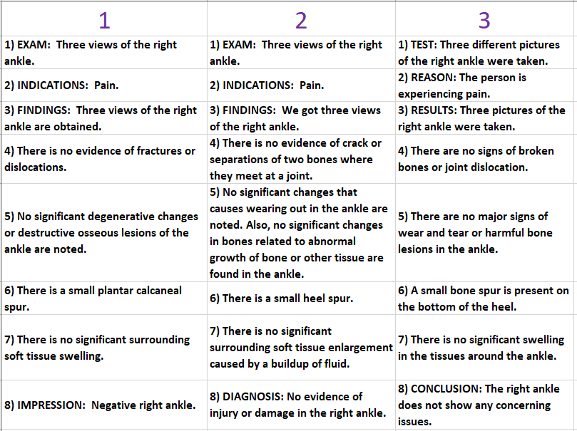

"These three texts contain the information for a right ankle exam." was added for clarification.

1. Question: Please evaluate the three texts according to their easiness of geting the general idea.
   
   Non-exclusive options:
   - Accessible to almost everyone
   - Accessible to people with college/university degree
   - Accessible to people with some medical background
   - Accessible to students of medical fields
   - Accessible to medical professionals only
   Results:
   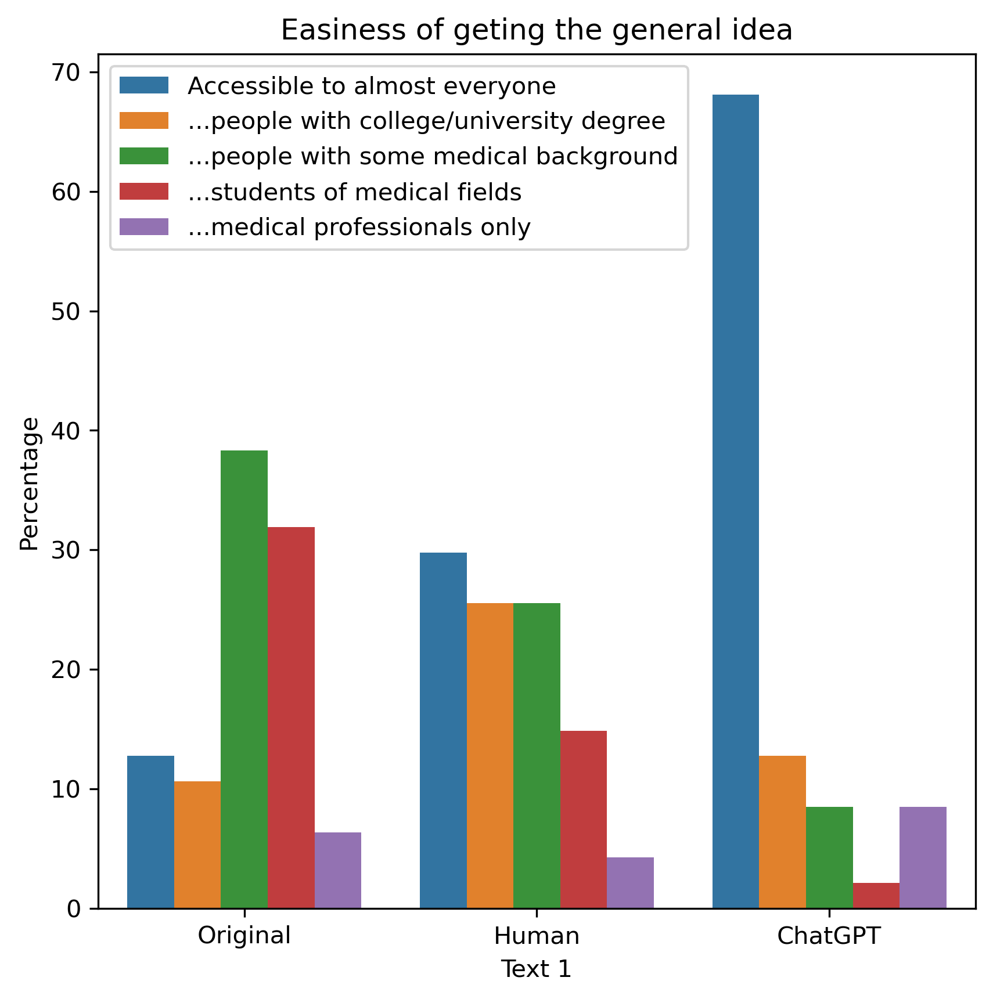
  
2. Question: Please evaluate the three texts according to the number of details provided.
   
   Non-exclusive options:
   - Very detailed
   - Has only necessary details
   - Missing some important details
   Results:
   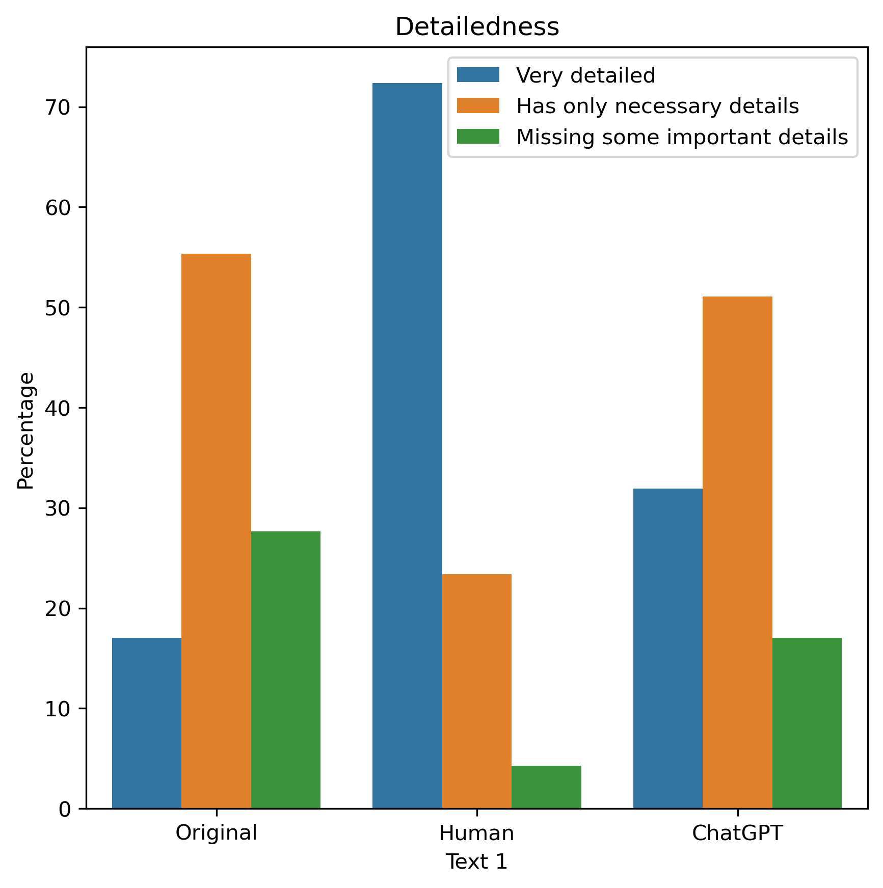

4. Question: Please evaluate the three texts according to their language fluency (how well are they written?).
   
   Non-exclusive options:
   - Well-written
   - Adequately written
   - Average
   - Somewhat poorly written
   - Poorly written
   Results:
   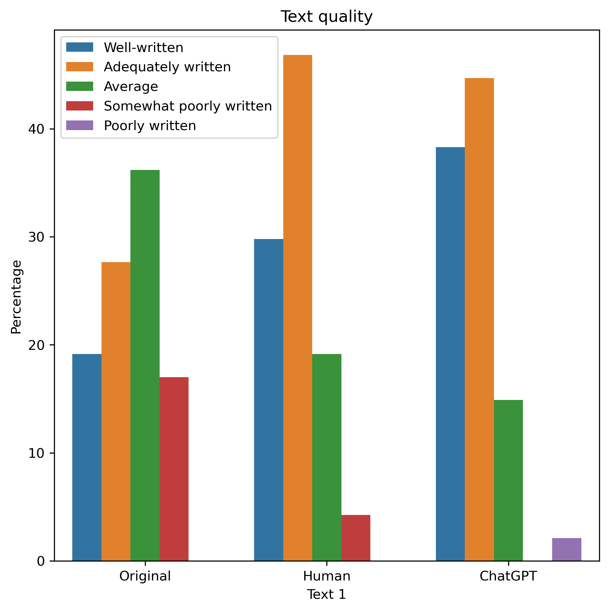
6. Question: Please evaluate the simplicity of these three texts (how easy is it to understand them?)
   
   Non-exclusive options:
   - Very easy
   - Easy
   - Moderate
   - Hard
   - Very hard
   Results:
   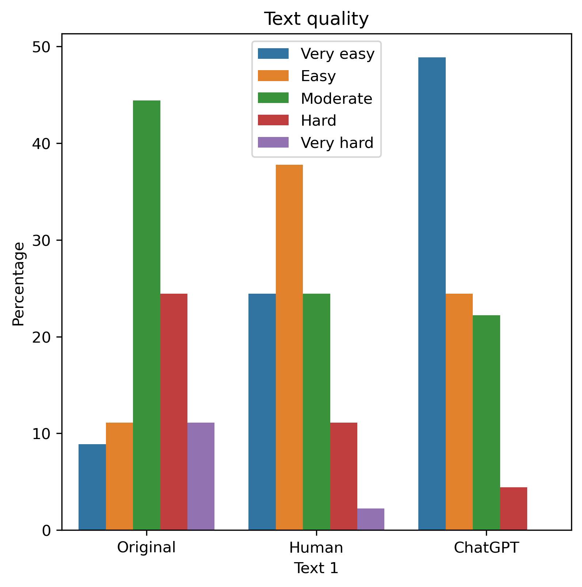

### Section 2
Section 2 contains the same questions as Section 1 but with different texts. Here Text 1 was human-simplified text, Text 2 was original text, and Text 3 was ChatGPT-simplified text.  
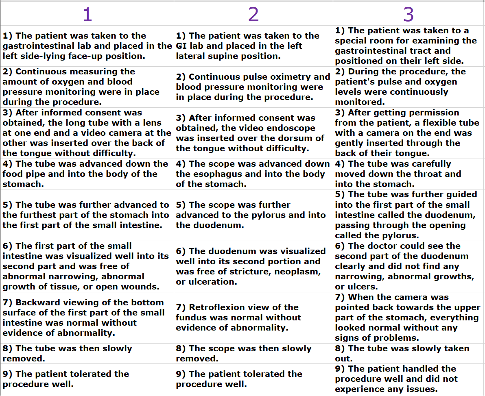

"These three texts contain the information for a gastrointestinal exam." was added for clarification.

1. Question: Please evaluate the three texts according to their easiness of geting the general idea.
   
   Non-exclusive options:
   - Accessible to almost everyone
   - Accessible to people with college/university degree
   - Accessible to people with some medical background
   - Accessible to students of medical fields
   - Accessible to medical professionals only
   Results:
   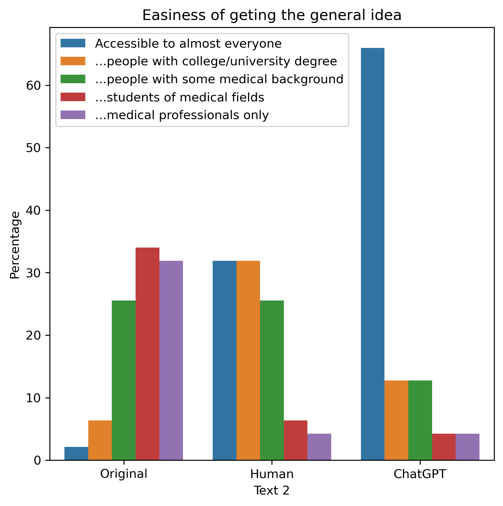
  
2. Question: Please evaluate the three texts according to the number of details provided.
   
   Non-exclusive options:
   - Very detailed
   - Has only necessary details
   - Missing some important details
   Results:
   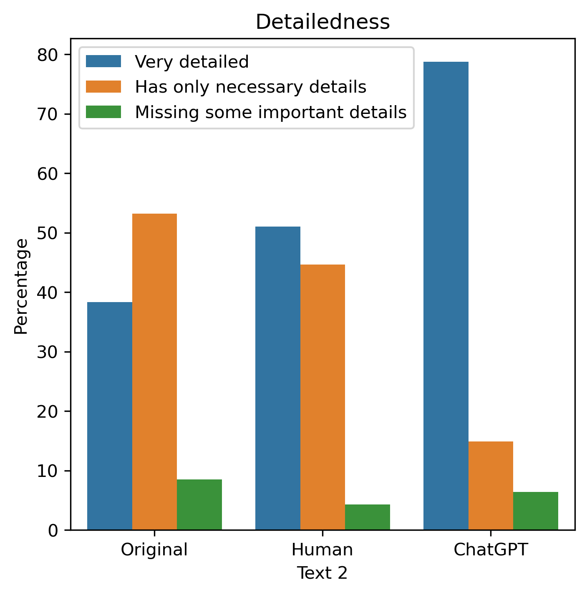

4. Question: Please evaluate the three texts according to their language fluency (how well are they written?).
   
   Non-exclusive options:
   - Well-written
   - Adequately written
   - Average
   - Somewhat poorly written
   - Poorly written
   Results:
   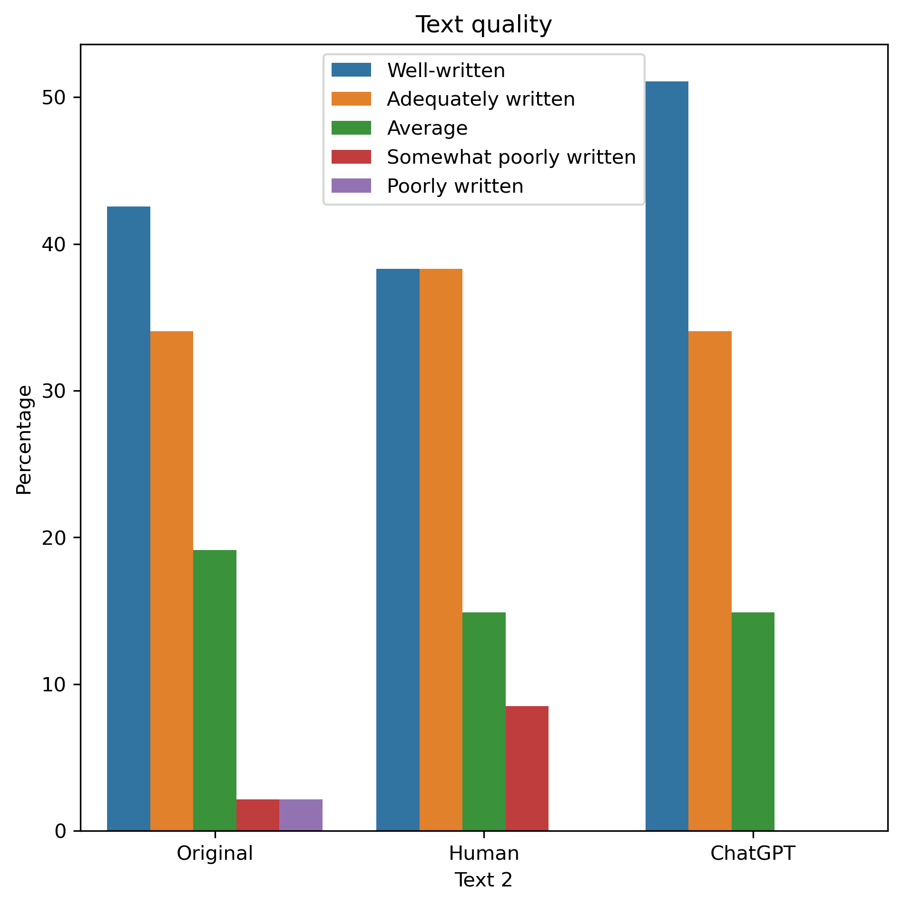
6. Question: Please evaluate the simplicity of these three texts (how easy is it to understand them?)
   
   Non-exclusive options:
   - Very easy
   - Easy
   - Moderate
   - Hard
   - Very hard
   Results:
   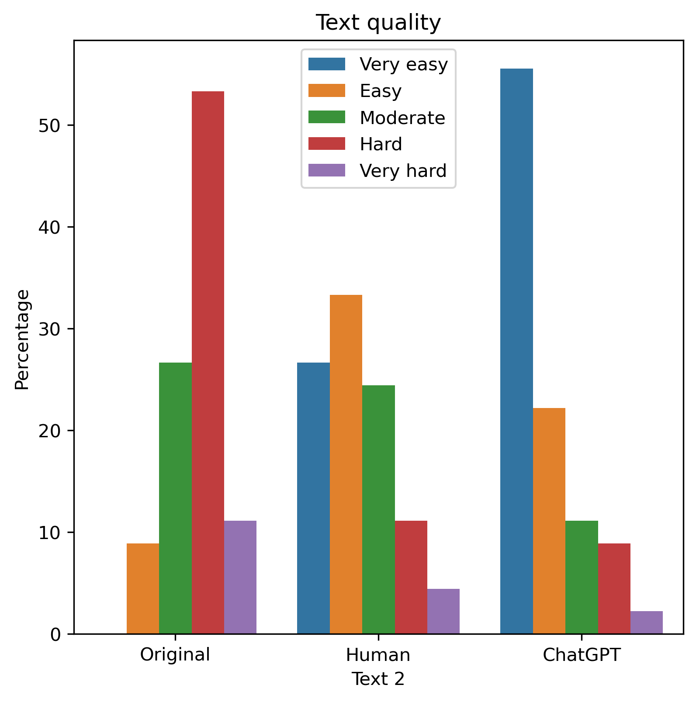


### Section 3 
In the third section, standalone sentences from medical texts were evaluated. The participants were given the original sentence, some context (description of the procedure from which the sentence was taken and an illustrative picture where applicable), and two possible simplifications to choose from. The questions were aimed to measure whether new forms retained clarity, factual accuracy, easiness of grasping the context, bias, misinterpretation, etc. 

Text:
``Below you will be presented with a number of image sentence pairs that are then followed by a question to be answered. 

The image sentence pairs include the picture itself, introduced with some context, which is then followed with a sentence which explains some part of the image presented. 

The question which follows the image sentence pair will ask you to select between two alternative sentences which are proposed as alternatives to the original sentence. Your task is to choose which of the two proposed alternatives best answers the question which follows the image sentence pair.``

Note: The information on whether a text is produced by Human or ChatGPT was not disclosed to the participants and the options were shuffled.

1. The image and text below relate to a surgery where a feeding tube is installed in the patient's abdomen. Which option retains the main idea or meaning of the text?
   
   **The Bolster was placed on the PEG site.**
   
   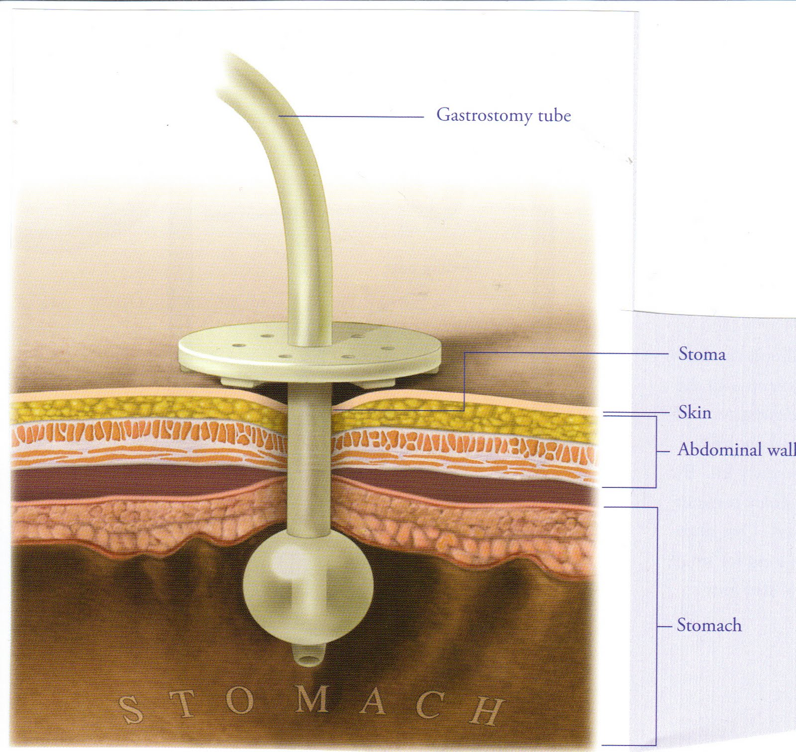
   
   Options:
   - Human: Another fixing device called Bolster was placed on the feeding tube from the outside.
   - ChatGPT: They placed a thing called a Bolster on the PEG site.

   ```mermaid
    pie
        title Results (%)
        "Human" : 51
        "ChatGPT" : 49
    ```
    
2. The image and text below relate to a surgery where a feeding tube is installed in the patient's abdomen. Which option is more clear and easy to understand?
   
   **The stomach was transilluminated and an optimal position for the PEG tube was identified using the single poke method.**
   
   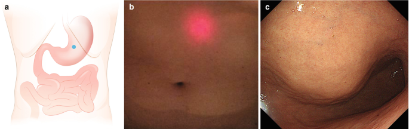
   
   Options:
   - Human: The tube with light and camera was put in the stomach and the best position for the feeding tube was identified. After that, the light was put on it from inside directed to outside. The light could be seen from the outside, and a finger was pressed against the abdominal wall where the light was located, so that the indentation was seen on the camera inside.
   - ChatGPT: They shone a light through the stomach and found the best place to put the tube using a method that only needed one hole.
  
    ```mermaid
    pie
        title Results (%)
        "Human" : 70
        "ChatGPT" : 30
    ```

3. The image and text below relate to a general examination of the patient's body. Which option maintains the factual accuracy of the original information?

   **CN: VFFTC, Pupils 5/5 decreasing to 3/3.**

   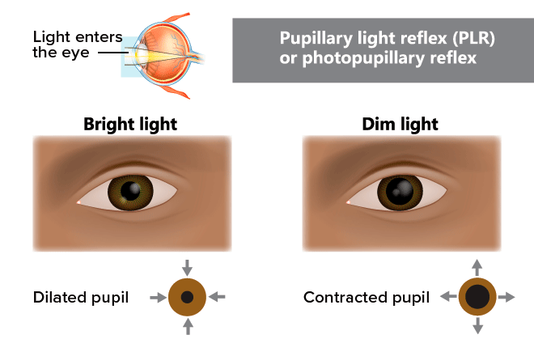

   Options:
   - Human: Brain nerves: no visual field defects have been identified, both pupils were of size five in the dark and of size 3 in bright light.
   - ChatGPT: CRANIAL NERVES: Vision, facial expression, hearing, and taste are working fine. Her pupils react to light, but the right pupil is smaller.
  
    ```mermaid
    pie
      title Results (%)
      "Human" : 70
      "ChatGPT" : 30
    ```
   
4. Which option is better at using relatable comparisons or examples to help the audience grasp the concept more easily?
   
   **HISTORY OF PRESENT ILLNESS: The patient is a 61-year-old white female status post right total knee replacement secondary to degenerative joint disease performed by Dr. A at ABCD Hospital on 08/21/2007.**
   
   - Human: HISTORY OF PRESENT ILLNESS: The patient is a 61-year-old white female after right total knee replacement because of the chronic process of wear and tear on the joint performed by Dr. A at ABCD Hospital on 08/21/2007.
   - ChatGPT: Story: A 61-year-old woman had surgery on her right knee on 08/21/2007 because of joint disease.

    ```mermaid
    pie
      title Results (%)
      "Human" : 47
      "ChatGPT" : 53
    ```

5. The image and text below relate to an endoscopic procedure. Which option better maintains an appropriate level of complexity, avoiding the loss of essential nuances?
  
    **An EGD was performed from above by Dr. X.**
  
    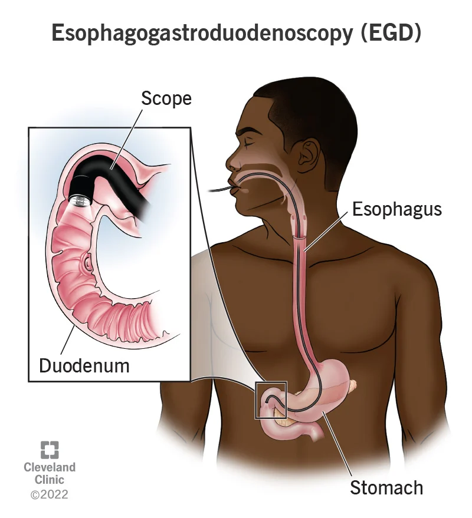
    
    - Human: An examination of the lining of the swallowing pipe, stomach, and upper part of the small intestine was performed from above by Dr. X.
    - ChatGPT: Dr. X used a special tool to look inside the patient's stomach from above.

    ```mermaid
    pie
      title Results (%)
      "Human" : 75
      "ChatGPT" : 25
    ```

6. The image and text below relate to a CT exam. Which simplification is better at maintaining the spirit and purpose of the original content, while making it more accessible?
   
    **EXAM: CT scan of the abdomen and pelvis without and with intravenous contrast.**
  
    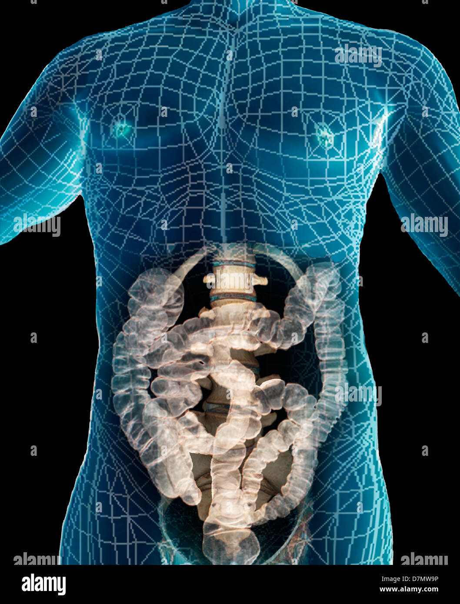
      
    - Human: EXAM: CT scan of the abdomen and pelvis without and with intravenous substance injection that helps differentiate soft tissues and blood vessels.
    - ChatGPT: TEST: Picture of the belly and lower pelvis using a CT scan, with and without a special liquid.

    ```mermaid
    pie
      title Results (%)
      "Human" : 77
      "ChatGPT" : 23
    ```

7. The text below relates to an abdomen and pelvis CT imaging performance from the previous question. Which option is more well-organized, well-structured, and easy to navigate?
   
    **Oral contrast was also administered.**
     
    - Human: The substance that helps differentiate soft tissues and blood vessels was also given through the mouth.
    - ChatGPT: They also made you drink some liquid.
  
    ```mermaid
    pie
      title Results (%)
      "Human" : 85
      "ChatGPT" : 15
    ```

8. The image and text below relate to a CT examination of the kidneys and ureter. Which option is more free from unnecessary details or information that doesn't contribute to the understanding of the main message?
   
    **There is no hydronephrosis or hydroureter.**
    
    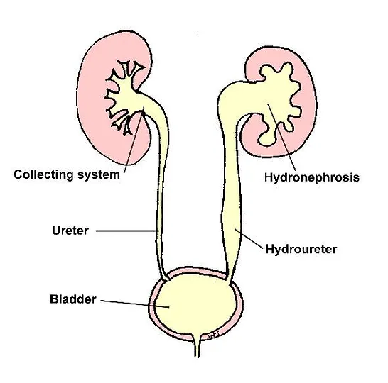
      
    - Human: There is no swelling or enlargement related to a condition when urine doesn't drain properly of kidneys and the tubes that connect the kidney to the bladder.
    - ChatGPT: Your kidney and urinary tubes don't have any extra swelling or water buildup.

    ```mermaid
    pie
      title Results (%)
      "Human" : 26
      "ChatGPT" : 74
    ```

9. The image and text below relate to a CT examination of the colon. Select an appropriate audience for each simplification option of the following text.
    
    **There are multiple diverticula in the rectosigmoid.**
    
    - Human: Multiple small bulges stick out of the side of the last section of the colon.	
    - ChatGPT: There are many small pockets in the lower part of your intestine.
  
    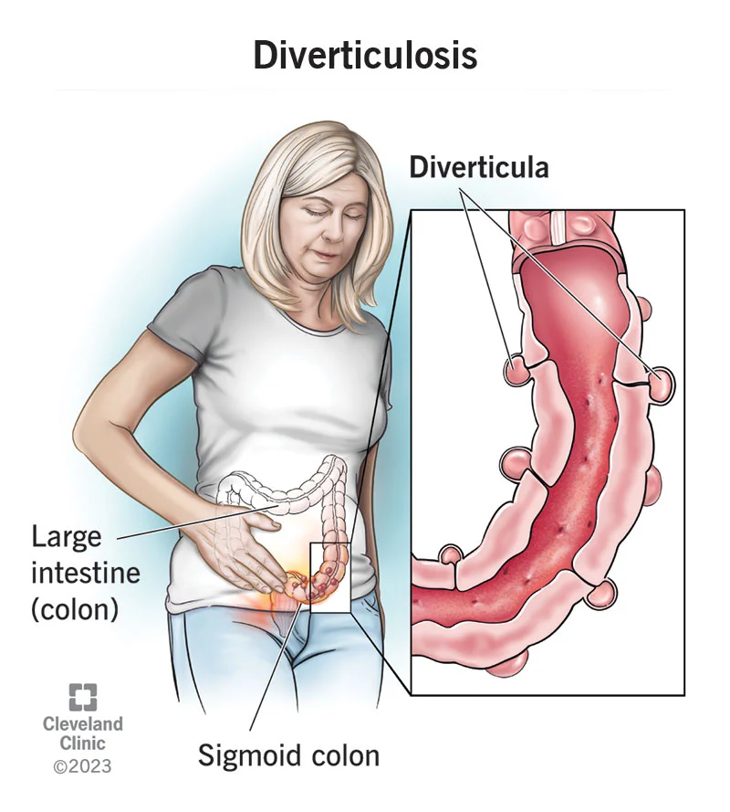
    
    Options:
      - Almost everyone
      - People with college/university degree
      - People with some medical background
      - Students of medical fields
      - Medical professionals

    ```mermaid
    pie
      title Results for Human text (%)
      "Almost everyone" : 34
      "People with college/university degree" : 19
      "People with some medical background" : 34
      "Students of medical fields" : 4
      "Medical professionals" : 9
    ```
    
    ```mermaid
    pie
      title Results for ChatGPT text (%)
      "Almost everyone" : 68
      "People with college/university degree" : 11
      "People with some medical background" : 8
      "Students of medical fields" : 11
      "Medical professionals" : 2
    ```

10. The image and text below relate to a CT examination of the colon. Which simplification piques the audience's interest and encourages them to explore the topic further?

    **There is evidence of focal wall thickening in the sigmoid colon (image #69) with adjacent fat stranding in association with a diverticulum.**
    
    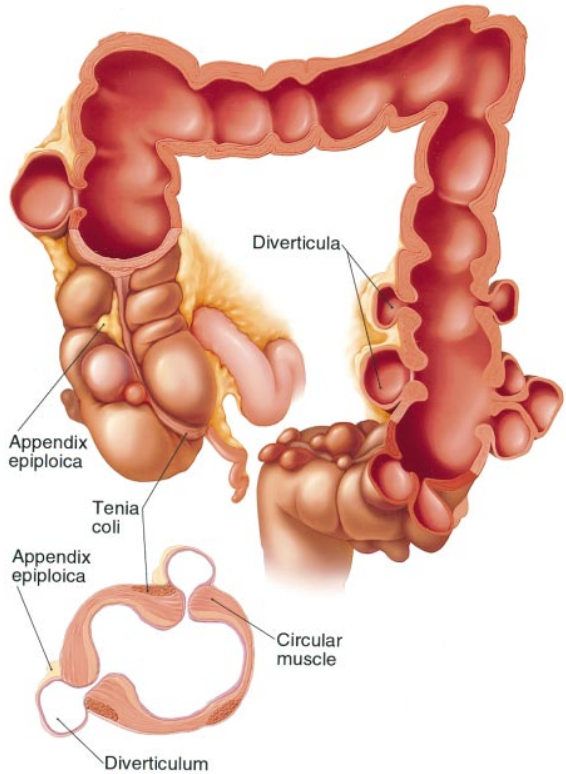
    
    - Human: There is evidence of wall thickening of a small area in the terminal portion of the large intestine before reaching the rectum (image #69). Here the adjacent fat is stranding inside in association with a small bulging sac pushing outward.
    - ChatGPT: In one part of the colon, the wall seems thicker in the picture (#69), and there's some fat around a pocket, which could mean diverticulitis.
   
    ```mermaid
    pie
      title Results (%)
      "Human" : 34
      "ChatGPT" : 66
    ```

11. The image and text below relate a pregnant's women UTI test checking the awaited baby. Which option is more unambiguous and straightforward?
    
    **CI (BPD/OFD): (70-86) 86**
  
    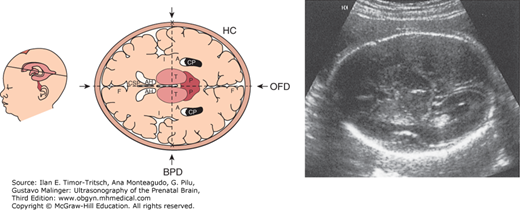
        
    - Human: The cephalic index (the ratio of the diameter of the head to the distance from the back fontanel to the root of the nose), used to categorize a baby's head shape: (normal range: 70-86) 86
    - ChatGPT: The ratio of head size to face size is 86, which is within the expected range (70-86).

    ```mermaid
    pie
      title Results (%)
      "Human" : 10
      "ChatGPT" : 90
    ```

12. The image and text below relate a pregnant's women UTI test checking the awaited baby. Which simplification is more free from bias or misrepresentation?
    
    **FL: 2.2cm consistent with 16 weeks, 4 days**
  
    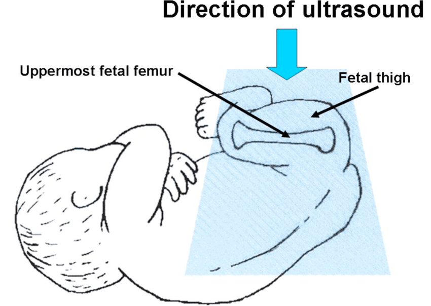
      
    - Human: The length of the thigh bone: 2.2 cm consistent with 16 weeks, 4 days
    - ChatGPT: The baby's leg bone length (FL) is like that of a baby at 16 weeks and 4 days

    ```mermaid
      pie
        title Results (%)
        "Human" : 70
        "ChatGPT" : 30
      ```

### Section 4
In this section, demographic information such as gender, age group, English language proficiency (native or non-native, bilingual, etc.), education, and information on whether participants belonged to the medical profession in some way (at a student or professional level) was gathered.

1. What is your gender?   
  Options:
    - Male
    - Female
    - Prefer not to say
    - Other

  ```mermaid
      pie
        title Results (%)
        "Male" : 51
        "Female" : 49
        "Prefer not to say" : 0
        "Other" : 0
   ```

2. What is your age category?   
  Options:
    - Under 25
    - 25-34
    - 35-44
    - 45-54
    - 55-64
    - 65+

  ```mermaid
      pie
        title Results (%)
        "Under 25" : 34
        "25-34" : 47
        "35-44" : 13
        "45-54" : 0
        "55-64" : 4
        "65+" : 2
   ```

3. Are you a native English speaker?
  Options:
    - Yes
    - No

  ```mermaid
      pie
        title Results (%)
        "Yes" : 47
        "No" : 53
   ```
    
4. If no, how would you rate your English language proficiency?   
   Options:
    - Basic
    - Good
    - Bilingual/Trilingual/Native equivalent
  
    ```mermaid
      pie
        title Results (%)
        "Basic" : 0
        "Good" : 39
        "Bilingual/Trilingual/Native equivalent" : 61
   ```

5. Please select the highest education level completed.   
   Options:
    - Less than high school diploma
    - High school diploma, GED, Leaving Certificate, or GCSEs
    - Undergraduate: Bachelors, associate degree
    - Masters degree
    - PhD
    - Post-doc
  
    ```mermaid
      pie
        title Results (%)
        "Less than high school diploma" : 0
        "High school diploma, GED, Leaving Certificate, or GCSEs" : 30
        "Undergraduate: Bachelors, associate degree" : 60
        "Masters degree" : 8
        "PhD" : 2
        "Post-doc" : 0
   ```
    
6. Are you a student in the medical sphere?   
   Options:
    - Yes
    - No
  
    ```mermaid
      pie
        title Results (%)
        "Yes" : 10
        "No" : 90
     ```

7. Do you consider yourself a medical professional (doctor, nurse, etc.)?   
   Options:
    - Yes
    - No
  
   ```mermaid
      pie
        title Results (%)
        "Yes" : 4
        "No" : 96
     ```
